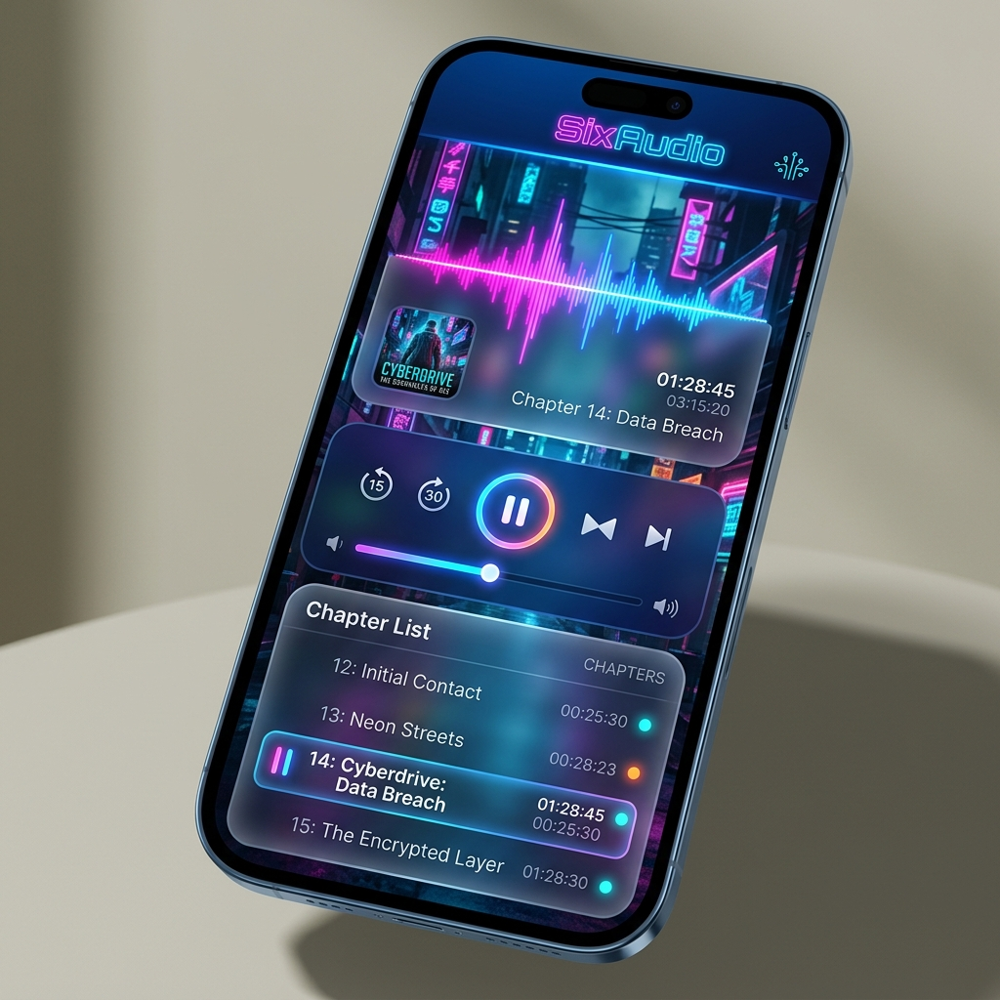

# ⚡ SIXAUDIO: CYBERPUNK TTS & NOVEL TOOLKIT ⚡

[](https://www.python.org/downloads/)
[](https://opensource.org/licenses/MIT)
[](https://github.com/rany2/edge-tts)

**SixAudio** is an immersive, high-performance toolkit for the modern bibliophile. Scrape your favorite web novels, transform them into premium neural audiobooks with dual-speaker SSML, and sync them across all your devices via a glassmorphism web player.



---

## 🚀 Key Features

### 🛠️ Core Engine
- **Web Scraping (DrissionPage)**: Bypass Cloudflare and bot detection on ScribbleHub, NovelBin, and more.
- **Advanced TTS (edge-tts v7.2.8+)**: Leveraging the latest neural voices from Microsoft Edge with automated 403-error mitigation.
- **Dual-Speaker Mode**: Intelligent SSML generation that distinguishes between **Narrator** and **Dialogue** for an immersive experience.
- **Audiobook Concatenation**: Seamlessly merge chapters into high-bitrate MP3s using FFmpeg.

### 📱 Connectivity & Cloud
- **Mobile Sync / Web Player**: Built-in **FastAPI** server with a premium, responsive Web UI. 
- **QR Code Pairing**: Instant mobile connection via local network discovery—just scan and listen.
- **Real-time Monitoring**: WebSocket-powered task tracking. Watch your scraping and TTS progress live on your mobile device.
- **Cloud Storage**: One-click synchronization to **Firebase / Google Cloud Storage**.

### 🧹 Intelligence & Cleanup
- **Smart Cleaner**: Proactively removes site metadata, "Author Notes", and promotional scripts.
- **Corruption Fixer**: Deep scan algorithm that identifies and repairs empty, truncated, or failed audio files.
- **Progress Tracking**: Persistent JSON-based state management with per-novel tracking.

---

## 🛠️ Tech Stack

| Layer | Technology |
| :--- | :--- |
| **Logic** | Python 3.12+ / Asyncio |
| **TUI** | [Rich](https://github.com/Textualize/rich) (Cyan/Magenta Cyberpunk Theme) |
| **Scraper** | [DrissionPage](https://github.com/g1879/DrissionPage) |
| **TTS Engine** | [edge-tts](https://github.com/rany2/edge-tts) (v7.2.8+) |
| **Server** | FastAPI / Uvicorn / Jinja2 |
| **Frontend** | Vanilla JS / CSS3 (Glassmorphism + WebSockets) |
| **Cloud** | Firebase Storage / GCS |
| **Audio** | FFmpeg / Pydub |

---

## 📥 Installation

### Prerequisites
- **Python 3.12+**
- **FFmpeg**: Required for audio merging. 
  - *Windows*: `choco install ffmpeg`
  - *Mac*: `brew install ffmpeg`
  - *Linux*: `sudo apt install ffmpeg`

### Setup
1. **Clone the project**:
   ```bash
   git clone https://github.com/thypolen2-droid/sixaudio-backend.git
   cd sixaudio-backend
   ```

2. **Activate Virtual Environment** (Windows PowerShell):
   ```powershell
   .\venv\Scripts\Activate.ps1
   ```

3. **Install dependencies**:
   ```bash
   pip install -r requirements.txt
   ```

---

## 🎮 Usage

Launch the **Unified Dashboard**:

```bash
python app.py
```

### Dashboard Modes:
- `1` **Scraping Mode**: Ingest novels from source URLs.
- `2` **Batch TTS**: Convert local text folders to audio (supports Dual Speaker).
- `5` **Fix Corrupted**: Auto-repair failed generations.
- `7` **Mobile Server**: Remote listening portal for mobile browsers.
- `10` **Cloud Sync**: Push your library to Firebase stars.

---

## 📂 Project Structure

```text
├── app.py              # Unified Dashboard (TUI Entry)
├── modules/
│   ├── scraper.py     # Chromium-based scraping engine
│   ├── tts.py         # edge-tts manager & SSML logic
│   ├── ui.py          # Carbon-style Rich UI
│   ├── server.py      # FastAPI Server (Mobile Access)
│   └── storage.py     # Cloud & Local IO providers
├── Library/           # Local Data (TXT + MP3)
└── assets/            # Project documentation assets
```

---

## 🛡️ Support

**Encountering 403 Errors?**
Ensure you are on the latest `edge-tts`: `pip install --upgrade edge-tts`.

**Missing Chapters?**
Check the `.story_progress.json` in your story folder to verify state.

---

*Built with ⚡ by Antigravity*
